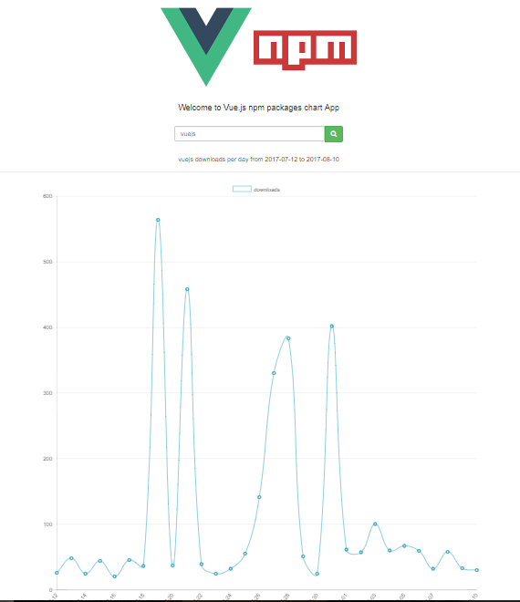

# Vuejs Tweet

> A simple Vue.js project which displays a graph for downloads of an npm package for last month using vue-charts, bootstrap and font-awesome.
<p align="center">
    
</p>


> credit: 
<a href="https://hackernoon.com/lets-build-a-web-app-with-vue-chart-js-and-an-api-544eb81c4b44" target="_blank">Let’s Build a Web App with Vue, Chart.js and an API</a>

## Build Setup

``` bash
# install dependencies
npm install

# serve with hot reload at localhost:8080
npm run dev

# build for production with minification
npm run build

# build for production and view the bundle analyzer report
npm run build --report

For detailed explanation on how things work, checkout the [guide](http://vuejs-templates.github.io/webpack/) and [docs for vue-loader](http://vuejs.github.io/vue-loader).
